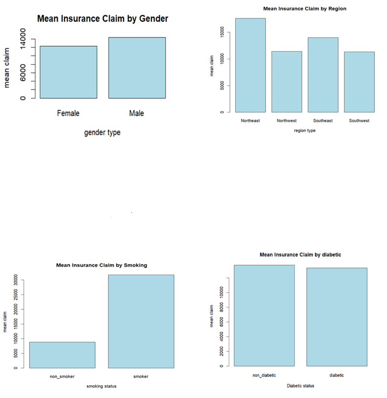
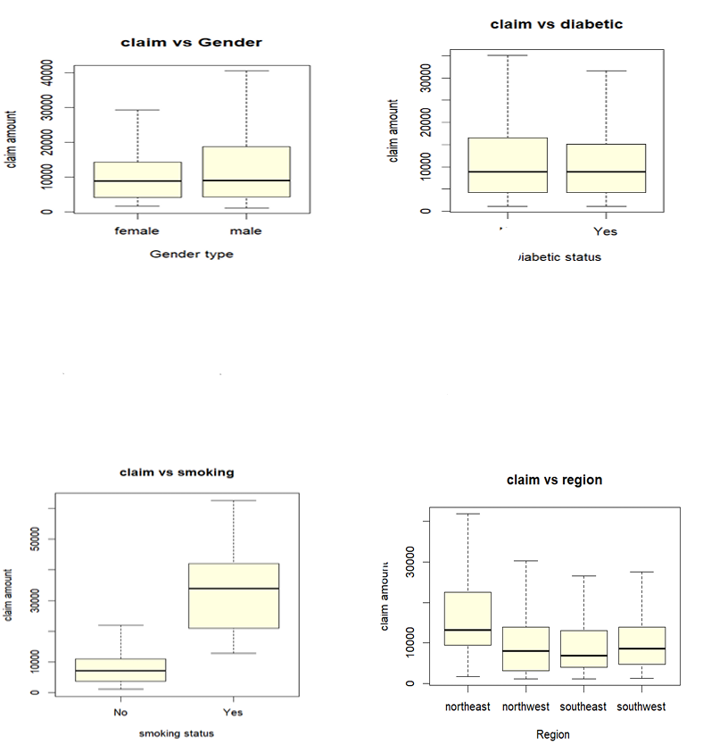

#  Insurance Claim Analysis using Sampling Techniques (R)

##  Overview
This project analyzes how demographic and health-related factors such as age, BMI, diabetes status, and smoking behavior influence insurance claim amounts. The study also compares different sampling techniques to evaluate their accuracy in estimating population parameters.

---

##  Objective
- Examine the relationship between health traits and insurance claims  
- Apply and compare different sampling methods  
- Evaluate estimation accuracy against population values  
- Identify the most effective sampling technique  

---

##  Tools & Techniques
- R Programming  
- Simple Random Sampling (SRS)  
- Stratified Sampling  
- Two-Stage Cluster Sampling  
- Data Visualization  
- Regression Estimation  

---
##  Visualizations

##  Key Insights
-  Strong relationship between **BMI and claim amounts**  
-  **Smokers incur significantly higher insurance costs**  
-  Health conditions like **diabetes increase claim values**  
-  **Stratified sampling produced the most accurate estimates**  
-  Other methods showed higher variability in estimates  

---

## 🚀 Conclusion
This analysis highlights the importance of selecting appropriate sampling techniques for accurate estimation. Stratified sampling proved to be the most reliable method, while also confirming that health-related factors significantly impact insurance claim amounts.

---
